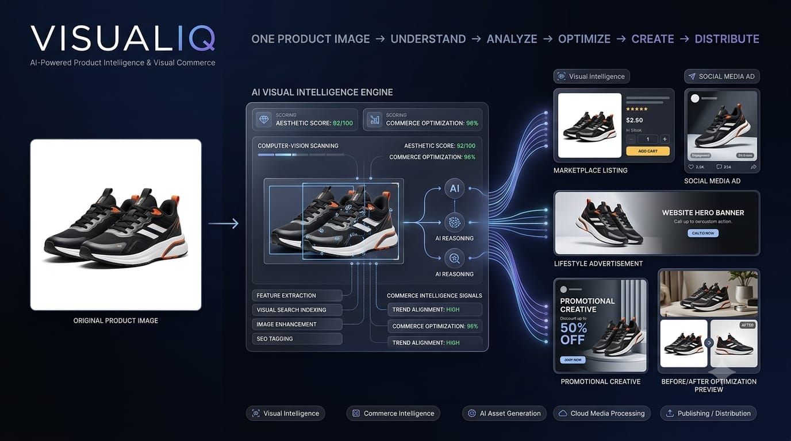
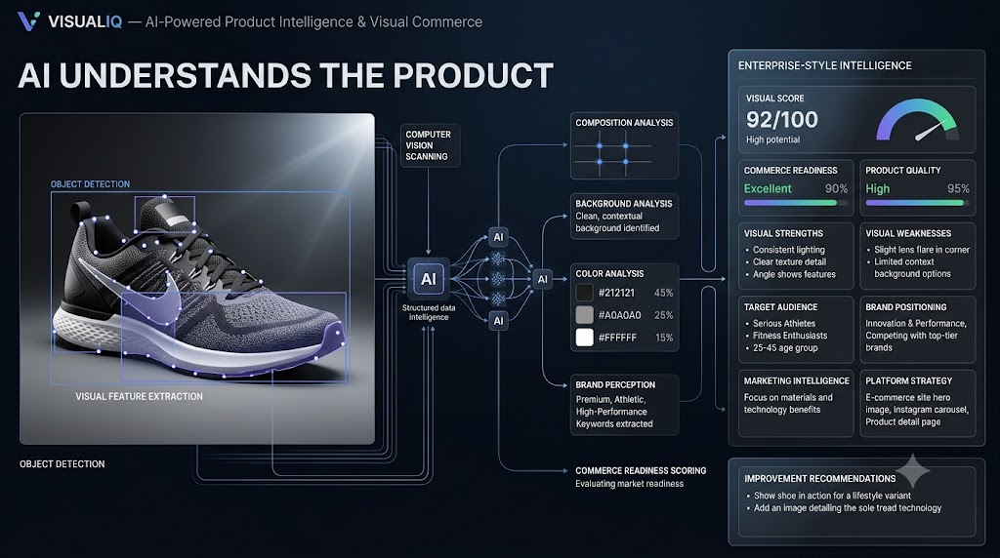

# 🚀 VISUALIQ

## AI-Powered Product Intelligence & Visual Commerce Studio

  

**Transform one product image into intelligent commerce-ready experiences.**

🧠 AI Product Intelligence • 🎨 Visual Commerce • ☁️ Cloud Media • 📊 Scoring • ✍️ Content Generation • 📤 Publishing

---

## 🌟 What is VISUALIQ?

**VISUALIQ** is an AI-powered visual commerce platform that transforms a single product image into a complete intelligence and content pipeline.

Instead of simply storing or displaying a product image, VISUALIQ:

**UPLOAD → UNDERSTAND → SCORE → ANALYZE → OPTIMIZE → CREATE → PUBLISH**

The platform combines visual intelligence, commerce analysis, Cloudinary media processing, AWS cloud storage, AI-assisted analysis, deterministic intelligence, automated asset generation, and content publishing into one unified workflow.

---

## 🎯 The Core Idea

  

A single product image becomes the starting point for a much larger intelligence pipeline.

